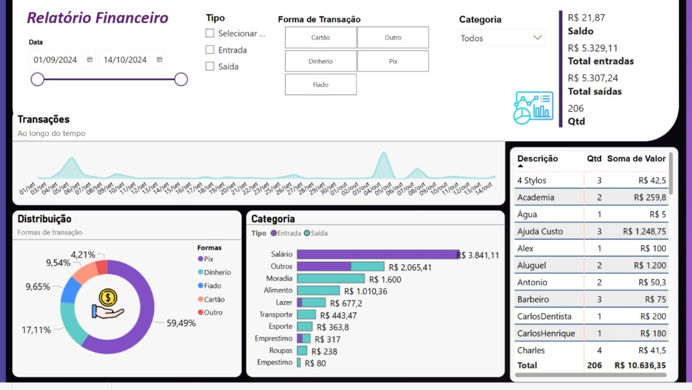

# Análise-Financeira-PowerBI

  ## Análise financeira desenvolvido no Power BI para visualizar padrões de receitas e despesas.

  

[Link do relatório](https://app.powerbi.com/view?r=eyJrIjoiMThhNDhjMmYtNzQyZi00OGU5LTk1ZTktM2Y3ZDg5MDAzODE0IiwidCI6IjY1ODQ3OGU5LTQxYjItNGZkNi1hNDkxLTlmYWNkZTBhNzVkNiJ9)

Análises no Relatório Financeiro (Power BI)
O relatório financeiro desenvolvido no Power BI permite uma análise abrangente das transações financeiras, proporcionando insights valiosos para controle e planejamento financeiro. Ele inclui:

✅ Filtros Dinâmicos: Possibilidade de segmentação por tipo de transação (entrada/saída), forma de pagamento (Pix, dinheiro, cartão, etc.) e categoria, proporcionando uma análise detalhada.

✅ Análise Temporal: Gráfico de tendência de transações ao longo do tempo, permitindo identificar padrões de receita e despesas em períodos específicos.

✅ Distribuição das Formas de Pagamento: Gráfico de rosca ilustrando a participação percentual de cada forma de pagamento, ajudando a visualizar preferências e dependências financeiras.

✅ Análise por Categoria: Gráfico de barras destacando a distribuição das transações por categoria, segmentado por entradas e saídas, facilitando a identificação dos maiores gastos e fontes de receita.

✅ Detalhamento de Transações: Tabela com descrição, quantidade e soma dos valores, permitindo uma visão granular das despesas e receitas.

## Aplicações Profissionais:

Identificação de padrões de consumo e possíveis oportunidades de economia.
Monitoramento de formas de pagamento mais utilizadas e sua relação com o fluxo financeiro.
Planejamento financeiro baseado na análise de categorias com maiores gastos.
Facilitação da tomada de decisão baseada em dados analisados.
